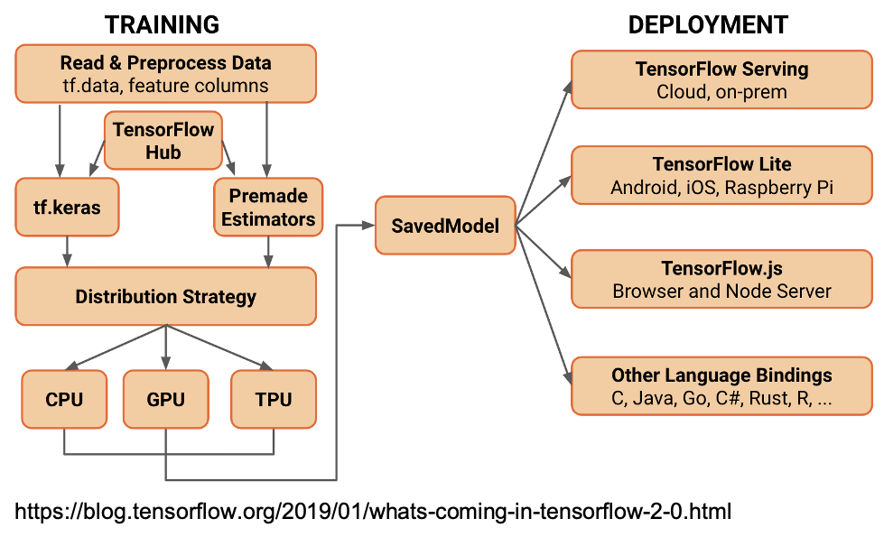
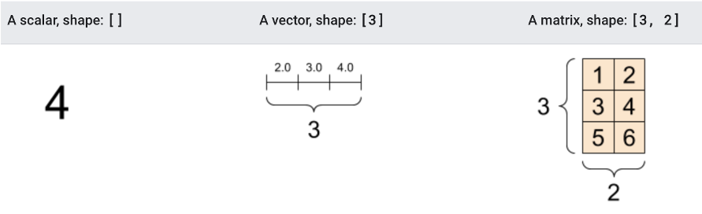
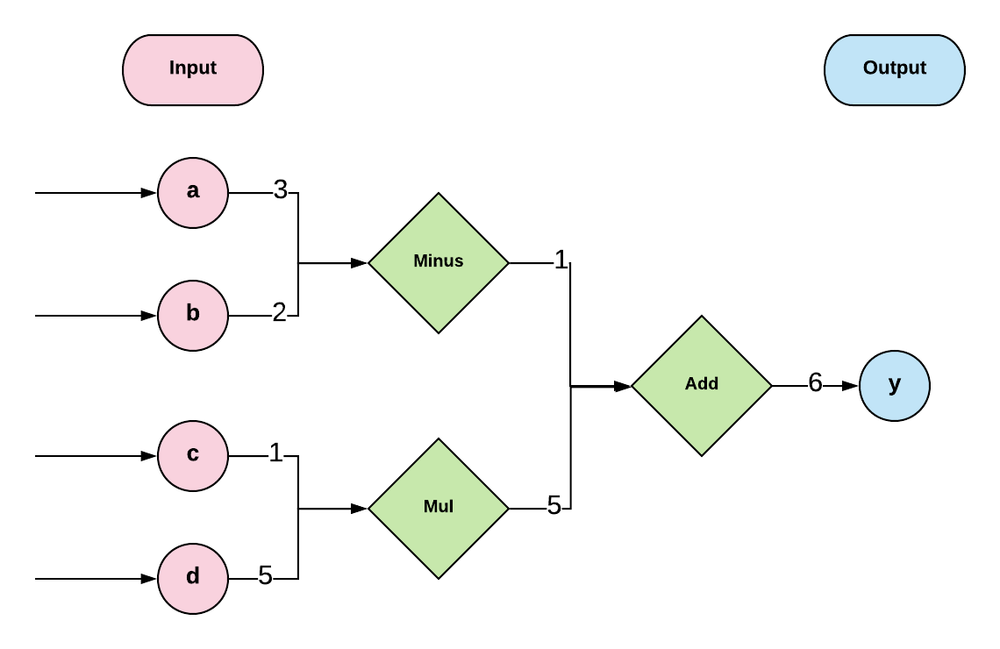

# Seminar 1: Getting started with TensorFlow 2.0

**Contents**:
* [Introduction to TensorFlow](#what-is-tensorflow) 
* [Installation](#installation)
* [Introduction to computational graphs](#what-is-a-computational-graph)                 
* [Basic operations in TensorFlow](#basic-operations)   
* [TensorFlow data types](https://www.tensorflow.org/guide/tensor)       
* [Graph building and execution](#implementation-of-your-graph)                                       
* [Example: linear regression](#linear-regression) 
* [Further references](#references)
  
## What is TensorFlow?

[TensorFlow](https://www.tensorflow.org/) is an open source library for machine learning research. Its core elements are written in C++ language and are able to execute on CPUs, GPUs and [TPUs](https://cloud.google.com/tpu/docs/tpus) (Tensor Processing Units). It provides a Python API for full access to these core elements. 

Just like other libraries, such as Numpy and Scipy, TensorFlow is designed to make the implementation of machine learning programs easier and faster.

## Installation 

We will be using [Google Colab](https://colab.research.google.com/) in our classes. But you if want to install TensorFlow on your local machine, you can follow the links below:

* [Install TensorFlow 2](https://www.tensorflow.org/install)
* [Install TensorFlow with pip](https://www.tensorflow.org/install/pip)

## TensorFlow architecture

The TensorFlow 2.0 architecture is organized in two major blocks: *Training* and *Deployment*. 

<!---  -->



*Training* comprises elements for data ingestion, model building and validation (through Keras and Estimators) and distributed training over different hardware accelerators (CPUs, GPUs and TPUs). Models can be saved and exported for sharing purposes (through TF Hub). The *Deployment* of saved models can be done on a variety of platforms and other languages. 

[This blog](https://blog.tensorflow.org/2019/01/whats-coming-in-tensorflow-2-0.html) provides an overview of these elements and discusses some differences between TensorFlow 1.x and TensorFlow 2.x.

All TensorFlow modules and classes can be found [here](https://www.tensorflow.org/api_docs/python/tf). 

#### Low level APIs and high level APIs

This year we will concentrate on TensorFlow 2.0, released in October 2019. 
As stated in the official guide (see [here](https://www.tensorflow.org/guide)): 

*There are multiple changes in TensorFlow 2.0 to make TensorFlow users more productive. TensorFlow 2.0 removes redundant APIs, makes APIs more consistent, and better integrates with the Python runtime with Eager execution.*
```
Major changes:
* Integrate eager execution: no more graphs and sessions
* Integrate Keras
* API cleanup
* No more variable scopes, global collections or helper methods like `tf.global_variables_initializer()`
* Autograph with @tf.function decorator
```
You can either code in the low-level TensorFlow API (**TensorFlow Core**) or in the high-level APIs.  

Although the high-level APIs provide a much simpler and consistent interface, it is still beneficial to learn how to use Tensorflow Core for the following reasons, as mentioned in the official documents:

* Experimentation and debugging are both more straightforward when you can use low level TensorFlow operations directly.
* It gives you a mental model of how things work internally when using the higher level APIs.

#### Further references on this topic

* [Migrate your TensorFlow 1 code to TensorFlow 2](https://www.tensorflow.org/guide/migrate)
* [tf.compat.v1.Session](https://www.tensorflow.org/api_docs/python/tf/compat/v1/Session)

## What is a tensor?

A tensor is an n-dimensional array of an uniform type (called a [dType](https://www.tensorflow.org/api_docs/python/tf/dtypes/DType)). You can think it as a Python list or a Numpy array but with different data types. 

A scalar is treated as a zero-dimensional (or *rank-0*) tensor, an array is treated as a one-dimensional (*rank-1*) tensor, and a matrix is treated as a two-dimensional (*rank-2*) tensor.



Refer to [this page](https://www.tensorflow.org/guide/tensor) for a detailed view of tensor types and related operations.

Let us demonstrate this by an example:

Firstly, import TensorFlow and Numpy:

```
import tensorflow as tf
import numpy as np
```

Define a 2 by 2 matrix using a Python list, a Numpy array and a tensor:

```
a1 = [[0.0, 0.5], [1.0, 0.0]]
a2 = np.array([[0.0, 0.5], [1.0, 0.0]], dtype=np.float32)
a3 = tf.constant([[0.0, 0.5], [1.0, 0.0]])

```

Print the data type of each object:

```
print(type(a1))
print(type(a2))
print(type(a3))
```

You will see the results as

```
<class 'list'>
<class 'numpy.ndarray'>
<class 'tensorflow.python.framework.ops.Tensor'>
```

You should always use TensorFlow data type whenever possible. This is because

* TensorFlow has to calculate the type of the array and may even have to convert it to TensorFlow type, which could slow your code down.

* Numpy arrays are not GPU compatible.


## What is a computational graph?
```diff
+ Only for demonstration! This section is not needed for TF2.0!
```

For equation *y=(a-b)+c*d*, the data flow shown below is called a computational graph:



[]()

Nodes are mathematical operations (e.g. `minus`, `mul`, and `add` in the graph), variables (e.g. `a`, `b`, `c` and `d`),  constants and tensors, i.e., your data.

  
## Implementation of your graph

#### Construction step

In our first seminar, the most important thing for you to learn about Tensorflow is that you start with **building the structure only**.


Let's define:

```
a = tf.constant(3.0)
b = tf.constant(2.0)
c = tf.constant(1.0)
d = tf.constant(5.0)

a_minus_b = tf.subtract(a, b)
c_times_d = tf.multiply(c, d)
y = tf.add(a_minus_b, c_times_d)
```

What would happen if we simply print `y`?

```
print(y)
```

You will get:

```
Tensor("Add:0", shape=(), dtype=float32) #NOT a number 6!
```

This is because so far we have only built the structure of the algorithm.

#### Execution Step

To get the value of `y`, you will have to summon a **session** so you can launch the operations,

```
with tf.Session() as sess:
    print(sess.run(y))
```

`tf.Session()` encapsulates the environment where operations are executed and tensors are evaluated.

Session will also allocate memory to store the current values of variables.

<!--- If you see this warning, -->
<!---  -->
<!--- add the following at the beginning of your code -->
<!--- import os -->
<!--- os.environ['TF_CPP_MIN_LOG_LEVEL']='2' -->
<!--- The warning states that your CPU doesn't support AVX. -->

```diff
+ Back to TF 2.0!
```
## Basic operations

#### Constants

```
tf.constant(value, dtype=None, shape=None, name='Const')
```

Example:

```
tensor = tf.constant([1, 2, 3, 4])
```

#### Define a tensor with a specific value and shape

```
tf.zeros(shape, dtype=tf.float32, name=None)
```

Example:

```
x=tf.zeros([2, 3])

print(x)
```

Output tensor:

```
[[0. 0. 0.]
[0. 0. 0.]]
```

You can also create a tensor of the shape as another tensor but all elements in the new tensor are zeros.

```
tf.zeros_like(input_tensor, dtype=None, name=None)
```

Example:

```
input = [[0, 1],[2, 3]]
```

`tf.zeros_like(input)` will output

```
[[0, 0],
[0, 0]]
```

The following operations are also available

```
tf.ones(shape, dtype=tf.float32, name=None)
tf.ones_like(input_tensor, dtype=None, name=None)
```

or

```
tf.fill(dims, value, name=None)
```

Example:

`tf.fill([2, 3], 8)` will have an output tensor with shape `[2, 3]` and all elements of value `8`:

```
[[8, 8, 8],
[8, 8, 8]]
```

#### Generate a sequence of numbers

Generate a fixed number of values that are evenly-spaced from `start` to `stop`. The last number equals to `stop`.

```
tf.linspace(start, stop, num, name=None)
```

Generate a sequence of numbers that begins at start and extends by increments of `delta` up to but not including `limit`.

```
tf.range(start, limit=None, delta=1, dtype=None, name='range')
```

#### Generate random constants

```
tf.random_normal
tf.truncated_normal
tf.random_uniform
tf.random_shuffle
tf.random_crop
tf.multinomial
tf.random_gamma
```

Fix a seed for replicability

```
tf.set_random_seed(seed)
```

#### Operations

##### Mathematical operations

```
tf.add
tf.subtract
tf.mul
tf.div
tf.exp
tf.log
...

```


##### Arithmetic operations

```
tf.abs
tf.negative
tf.sign
tf.square
tf.sqrt
...

```


##### Array operations

```
tf.concat
tf.slice
tf.split
tf.rank
tf.shape
...

```
##### Matrix operations

```
tf.matmul
tf.matrix_inverse
tf.matrix_determinant
...

```

## tf.Variable

From [TensorFlow documentation](https://www.tensorflow.org/guide/variable): A variable maintains shared, persistent state manipulated by a program.

The *Variable()* constructor requires an initial value for the variable, which can be a Tensor of any type and shape. This initial value defines the type and shape of the variable. After construction, the type and shape of the variable are fixed. The value can be changed using one of the assign methods.

```
tf.Variable(<initial-value>, name=<optional-name>)
```

tf.Variable class holds several methods:

```
tf.Variable.initializer
tf.Variable.value
tf.Variable.assign
tf.Variable.assign_add
...
```

Have a look at the [tf.Variable](https://www.tensorflow.org/api_docs/python/tf/Variable) attributes and methods.


#### tf.constant vs tf.Variable

- `tf.constant` is an operation, whilst `tf.Variable` is a class with many operations.

- Constants are stored in the graph and every time when you load the graph the values created by `tf.constant` are replicated.

When the constant values are big, loading a graph becomes expensive. In comparison, variables are stored separately.

- You cannot change the value of a tensor if it's declared using `tf.constant`.

One can initialise a variable by

```
a = tf.Variable(2)
```

and change the original value with

```
a.assign(a + 1.0)
```

or

```
a.assign_add(1.0)
```


## Linear regression

We intend to model a linear relationship between a dependent variable `y` and an independent variable `x`.

Consider a simple linear regression model  , where `w` is the weight parameter and `b` is the bias parameter.

1. Download `auto_insurance_in_sweden.csv` from the course repository (alternatively, from [Kaggle](https://www.kaggle.com/sunmarkil/auto-insurance-in-sweden-small-dataset)).
2. Refer to [week1.ipynb](./week1.ipynb) notebook to complete this exercise.

## Homework: logistic regression

Use the following code to generate data:
```
x1 = np.random.normal(-4, 2, 1000)
x2 = np.random.normal(4, 2, 1000)
xs = np.append(x1, x2)
ys = np.asarray([0.] * len(x1) + [1.] * len(x2))
```
 
Use the data `xs` and `ys` for training. The model is , where  is the sigmoid function and `w` and `b` are the parameters of the model. 
 
 <!--- title="\Large x=\frac{-b\pm\sqrt{b^2-4ac}}{2a}" /> -->
 
 **Task**: Find the optimal parameters and plot the fitted model to the data.
 
 **Hints**: 
 - You could use `tf.sigmoid()` function in TensorFlow
 - Use cross entropy loss:  
 <!--- title="\Large x=\frac{-b\pm\sqrt{b^2-4ac}}{2a}" -->
 - Use **gradient decent optimiser** with learning rate parameter equal to 0.01 
 - Use the number of iterations equal to 1000 


## References

* [Official TensorFlow tutorial](https://www.tensorflow.org/tutorials/)
* [Offical TensorFlow guide for low level APIs](https://www.tensorflow.org/guide/low_level_intro)
* [Offical TensorFlow guide for high level APIs](https://www.tensorflow.org/guide/keras)

