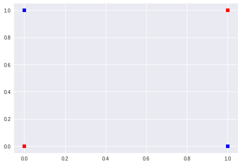
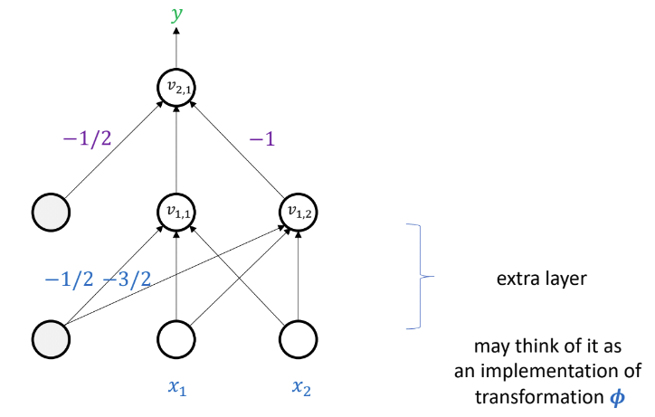
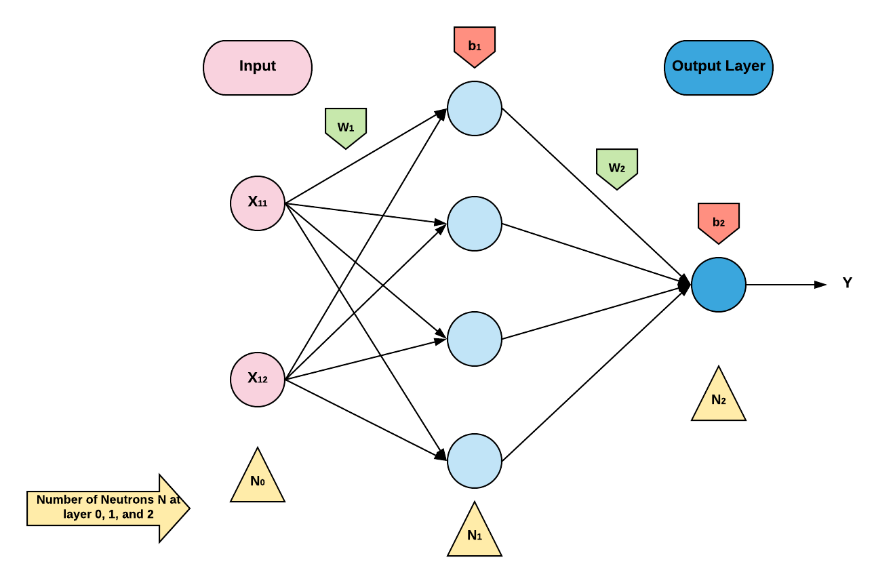
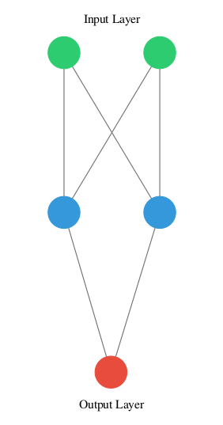
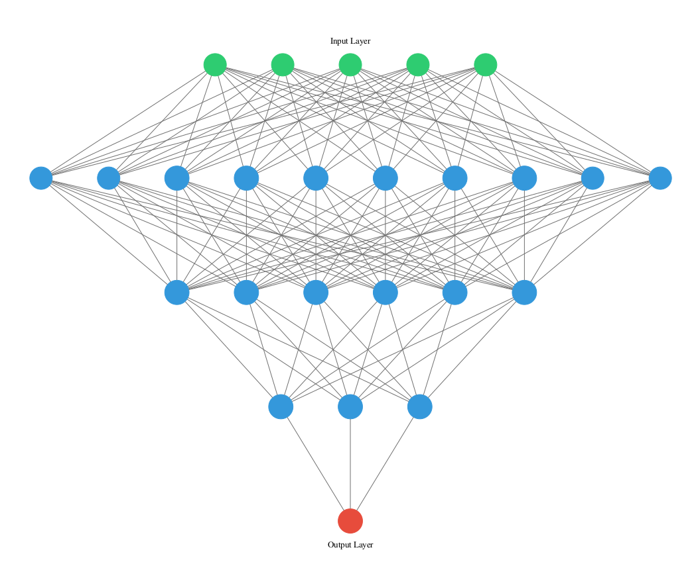
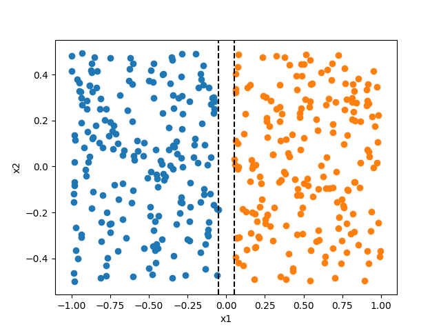
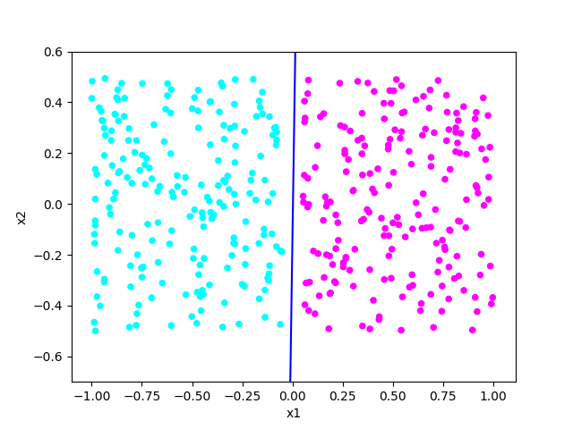

# Seminar 2: Feedforward Neural Networks

Our goals in this seminar session are:

* To learn some new TensorFlow library concepts.
* To implement, train, and evaluate a neural network that solves the XOR problem.
* To implement and run the single-layer perceptron learning algorithm (homework).

## XOR problem

### Visualise the problem

Firstly, import all the libraries we will use and fix seed for replicability, 
```
import tensorflow as tf
import matplotlib.pyplot as plt
import numpy as np
```
create data, and 
```
x = np.array([[0.0, 0.0], [0.0, 1.0], [1.0, 0.0], [1.0, 1.0]])
y = np.array([[0.0], [1.0], [1.0], [0.0]])
```
write a plotting function to visualise the input data.
```
def plot_xor(x):
  plt.plot([x[0, 0], x[3, 0]], [x[0, 1], x[3, 1]], 'rs')
  plt.plot([x[1, 0], x[2, 0]], [x[1, 1], x[2, 1]], 'bs')
  plt.show()
```
Passing our data to the plotting function, as we can see in the image below, we cannot find a linear classifier that separates the red dots from the blue dots.



### One solution

In the lecture, we found this solution



We essentially need to find a mapping  that transforms the input points into a feature space in which the points are linearly separable.

We will therefore create a neural network with a single hidden layer to solve the XOR problem.

### Intuition for variable sharing when using neural networks

Consider the linear regression example in Seminar 1.  We are fitting the model  to all the training data points, i.e., the parameters are shared across the entire training dataset.

Similarly, the same logic applies when using neural networks. Consider the following network which has one hidden layer with four neurons and an output layer with one neuron, 



Each forward pass takes only one input data point which has a dimensionality of 2. To find the optimal parameters for the entire training dataset, we need to make sure that the same set of parameters are updated in the training process. 

### Implement the neural network

#### Compute the dimensionality of parameters


We see that the dimensionality of the weight matrix `w` and of the bias `b` are   and  , where  is index of a layer and  is the index of the preceding layer. 

Let's create a neural network to solve the XOR problem using what we have learned so far. 

See [Python notebook Week2](week2.ipynb).

## Visualise a neural network architecture

You can use the library called **ANNvisualizer** to visualise a neural network architecture.  Unfortunately this is not yet compatible with any Python notebooks. If you have installed a Python IDE, you can follow the instructions to install the library.

For Windows users, open your Anaconda prompt and activate your virtual environment, and then install `graphviz`, `keras` and `ann_visualizer` by
```
conda install -c anaconda graphviz
```
```
pip3 install keras
```
```
pip3 install ann_visualizer
```
And, for Linux/macOS, you can use the following commands after activating your virtual environment,
```
sudo apt-get install graphviz && pip3 install graphviz
```
```
pip3 install keras
```
```
pip3 install ann_visualizer
```
To create the neural network we just implemented, we simply add two layers to the graph. The first layer has an input dimensionality of 2 and 2 neurons, and the output layer has 1 neuron. 
```
from keras.models import Sequential  
from keras.layers import Dense  
from ann_visualizer.visualize import ann_viz  

network = Sequential()  
#Hidden Layer#1  
network.add(Dense(units=2, activation='relu',  kernel_initializer='uniform', input_dim=2))  
#Output Layer  
network.add(Dense(units=1, activation='sigmoid', kernel_initializer='uniform'))  
ann_viz(network, title="")
```


An example with more layers and neurons,
```
network = Sequential()  
#Hidden Layer#1  
network.add(Dense(units=10, activation='relu', kernel_initializer='uniform', input_dim=5))  
#Hidden Layer#2
network.add(Dense(units=6, activation='relu', kernel_initializer='uniform'))  
#Hidden Layer#3
network.add(Dense(units=3, activation='relu', kernel_initializer='uniform'))  
#Output Layer  
network.add(Dense(units=1, activation='sigmoid', kernel_initializer='uniform'))  
ann_viz(network, title="")
```



This library can also visualise convolutional neural networks, which may be useful for our future lectures. 

## Homework: single-layer perceptron algorithm

### Generate inputs

- Fix random seed using the following code:
```
np.random.seed(1)
```

- Sample two classes of points: (a) 200 data points from a uniform distribution on [ /2, 1] x [-1/2, 1/2] and (b) another 200 data points from a uniform distribution on [-1, -/2] x [-1/2, 1/2], where  is a margin parameter. The margin parameter is a lower bound on the distances between any two points in different classes. See figure below for an illustration:



```
gamma = 0.1  
a1 = np.random.uniform(-1.0, -gamma / 2.0, size=200)  
a2 = np.random.uniform(-0.5, 0.5, size=200)  
  
x1 = np.random.uniform(gamma/2.0, 1.0, size=200)  
x2 = np.random.uniform(-0.5, 0.5, size=200)  
  
c1 = np.squeeze(np.dstack((a1, a2)))  
c2 = np.squeeze(np.dstack((x1, x2)))
```
- Generate labels, concatenate samples in both classes and randomly shuffle them:
```
# create labels  
y1 = np.negative(np.ones(200))  
y2 = np.ones(200)  
  
data = np.concatenate((c1, c2))  
labels = np.concatenate((y1, y2))  
  
# shuffle the data in the same way  
randomize = np.arange(len(data))  
np.random.shuffle(randomize)  
data = data[randomize]  
labels = labels[randomize]
```
### Tasks

*The number of mistakes is defined as the number of iterations at which the algorithm changes the parameter vector values*

- Plot the input data points as shown above
- Implement the single-layer perceptron learning algorithm (see Lecture 2 for definition) in TensorFlow (with  being the identity mapping, i.e., )
- Run the algorithm for the value of parameter 
- Plot the decision boundary after training (as shown below)
- Plot the perceptron criterion loss function versus the number of mistakes
- Record the total number of mistakes made by the algorithm until convergence and compare with the upper bound in the lecture
- Extra: if you're ambitious, you may also do the following:
   - Plot the loss function value versus the number of mistakes for different shufflings of the training dataset. What do you observe?
   - Run the algorithm for different values of parameter  and then plot the number of mistakes after the algorithm converged versus . How does the number of mistakes compare to the upper bound in the lecture notes?

**Hints**
```diff
Use assign_sub() method of tf.Variable instead of assign
```
- The single-layer perceptron learning algorithm is an online learning algorithm (of stochastic gradient descent type), so you should not pass the whole dataset before making a parameter update. The loss value and parameter update are computed after each input data point is passed to the computational graph. 
-   The parameter update rule is defined in Lecture 2. When assigning values to variables in TensorFlow, use 
```
tf.assign(ref, value, validate_shape=None, use_locking=None, name=None)
```
- Stop when there are no misclassified training data points
- See figure below for an illustration of decision boundary:


